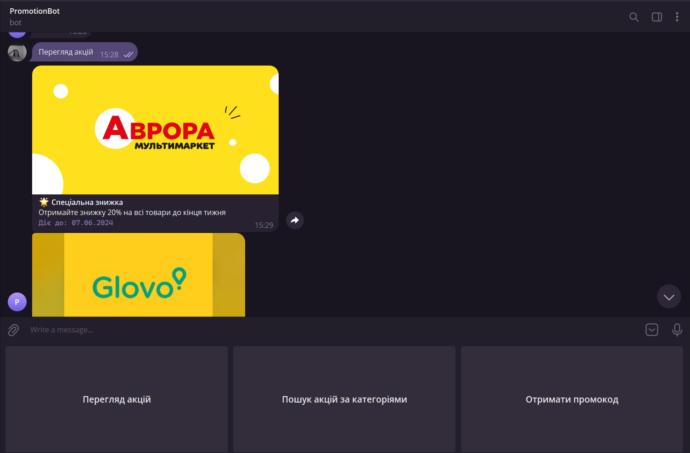
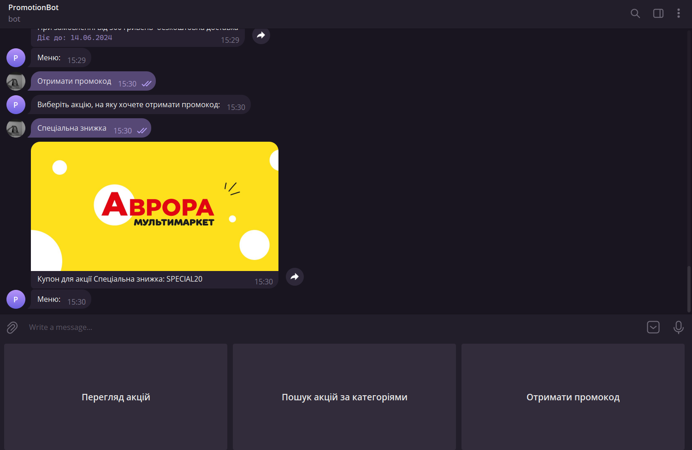

# Практична робота № 2

# ПАРАЛЕЛЬНІ ЗАДАЧИ ТА МЕРЕЖЕВА ВЗАЄМОДІЯ

# Мета

Вивчення особливостей розробки та програмування паралельних задач, мережева взаємодія та закріплення навичок об'єктно-орієнтованого програмування.

# Завдання

Розробити програмний чат-бот для Telegram [1], використовуючи методи та засоби паралельного програмування платформи .Net. Бот повинен мати базовий набір функціональних можливостей для взаємодії з користувачами, включаючи відправлення повідомлень, обробку команд та використання асинхронних методів для ефективної роботи. Складність і функціональність бота визначається самостійно (див. табл. 2.1) і вибирається по одному з наступних напрямків:

– предметна область відповідає курсовому проекту з ООП (допускається реалізація як самостійної програми чат-бота, так і з інтеграцією безпосередньо у курсовий проект);

– предметна область визначається на основі даних з одного або декількох відкритих та загальнодоступних Web API [2 - 4]. Чат-бот фактично організує інтерфейс користувача в Telegram для інформації, яка отримується з вибраного Web API, наприклад, за допомогою методів класу HttpClient;

–  Інші варіанти предметної галузі (після обговорення з викладачем).

# Порядок виконання роботи

1. У Telegram знайти спеціальний вбудований бот BotFather, в якому за допомогою команди /newbot створити власний чат-бот та отримати його API-Token. Зверніть увагу, що API-Token є секретом та не підлягає розголошенню!
2. Створити новий проект у середовищі розробки Visual Studio чи іншій IDE для .Net . Тип проекту може бути будь-яким.
3. Налаштувати проект для роботи з Telegram API (наприклад, через менеджер NuGet встановити пакет Telegram.Bot ) [ 1] .
4. Створити у програмі екземпляр класу TelegramBotClient з отриманим API-Token.
5. У створеному у п.4. об'єкті реалізувати та підключити обробники помилок та повідомлень бота.
6. Реалізувати код для обробки команд (наприклад, /start, /help тощо на власний розсуд), які керують логікою роботи чат-бота.
7. Реалізувати код надсилання повідомлень користувачу та обробки повідомлень,які надходять від користувача.
8. Використовувати асинхронні методи для мережної взаємодії та виконання тривалих операцій (наприклад, запити до стороннього API).
9. Протестувати бота на локальній машині та/або розгорнутого на хостингу.

Таблиця 2.1
| №  | Складність           | Вимоги до роботи                                                                                                 | Бали | Що виконано |
|----|----------------------|------------------------------------------------------------------------------------------------------------------|------|-------------|
| 1  | Базовий рівень       | Створення та налаштування проекту для роботи з Telegram API                                                      | 1    |       +     |
| 2  | Базовий рівень       | Використання елементів Telegram як меню команд, "клавіатур" для організації інтерфейсу користувача               | 1    |       +     |
| 3  | Базовий рівень       | Реалізація функціональності чат-бота відповідно до обраної предметної області (текстові повідомлення та команди) | 3    |       +     |
| 4  | Підвищений рівень    | Використання мультимедійного контенту у процесі взаємодії з користувачем (на додаток до п.3)                     | 1    |       -     |
| 5  | Підвищений рівень    | Розгортання чат-бота на зовнішньому/хмарному хостингу                                                            | 2    |       -     |

# Варіант 5
Предметна область відповідає курсовому проекту з ООП - "Акційні пропозиції"

Результат створення бота
Створено бота акційних пропозицій (PromotionBot) за допомогою вбудованого бота BotFather.

Що може бот PromotionBot:

- Надає можливість переглядами всі акційні пропозиції

  
- Надає можливість шукати акційніц промозиції за категоріями

  
- Надає можливість отримання промокоду

# ВИСНОВОК

Під час виконання практичної роботи було створено телеграм бот PromotionBot для акційних пропозицій. Бот надає можливість користувачам переглядати акційні пропозиції, шукати їх за категоріями та отримувати промокоди.

